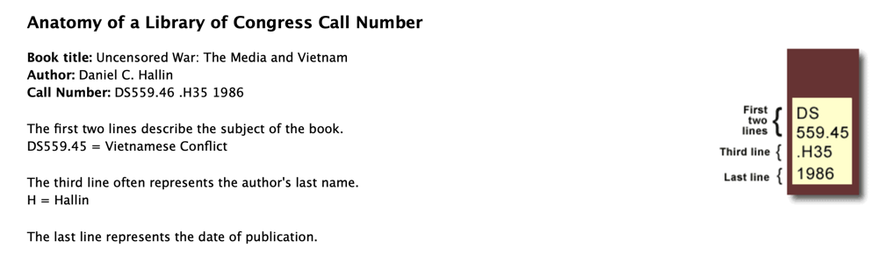

# Library of Congress Classification to Spine Label
## What is on the spine label

I decided to make my library look more like a real library, by putting
spine labels on the books. The advantages are never having trouble finding a book and in one case
finding I had two copies, one I had bought, and one I had taken from
my parents&rsquo; home when we closed it up. The disadvantage is the book will
be less valuable, but the value of books other than antiquaria (which I will not
put stickers on) is dropping fast.

There are a number of websites and software packages to take a stab at this,
of which I chose [LibraryThing](https://www.librarything.com/home). They have apps
for iPhone and Android that will read ISBN barcodes found on the back of
many recent books. Other books can be searched by typing in the ISBN, the older Library
of Congress catalog number, or, _in extremis,_ by title and author.

Then I realized I was on my own for printing the actual labels. (There seem to be
some paid programs to do this, but…) I didn&rsquo;t know much about how the labels worked.
Here is what I learned.


Screenshot from the [University of Georgia](https://www.usg.edu/galileo/skills/unit03/libraries03_04.phtml).

The call number begins with a one- or two-letter (apparently in a few cases three-letter)
[code](https://www.loc.gov/catdir/cpso/lcco/) that indicates the general field. The second part, which begins with a number,
is a more specific indicator of the topic, and the optional part after the decimal point
is a subtopic. This example doesn’t show it, but sometimes the subtopic is further divided into
sub-subtopics. The classification system is over one hundred years old, and times change. Mathematics spans
all of QA.
Computer programming falls
under [QA75 and QA76](https://www.loc.gov/aba/cataloging/classification/lcco/lcco_q.pdf), two topics
devoted to “Calculating machines”. That says something about how unimportant machines were to math in 1910.

Software is only one aspect of computer science, and it has been assigned QA76.75 to QA.76.765. Not
much space!
Joshua Block’s great book _[Effective Java](https://www.oreilly.com/library/view/effective-java-3rd/9780134686097/)_ 
on writing better Java code has classification QA76.73.J38. QA76.73 is programming, and the J38
sub-subtopic refers to Java. J38 encodes &ldquo;Jav&rdquo;. The J is obvious; the 38 is from
the [Cutter tables](https://en.wikipedia.org/wiki/Cutter_Expansive_Classification#Cutter_numbers)
that attempt to use letter frequency to encode nouns for alphabetic sorting
in fewer characters
than spelling them out. Note that this is all part of the _second_ line of the label. If you are
curious, C++ programming books are under topic QA76.73.C153. Cutter numbers seldom have the digit 1,
but in this case the plus sign doesn&rsquo;t appear in the standard alphabet.

The third line of the label is usually a Cutter number for the author. For Joshua Block, it is B57.
What I did not know until starting this project is while the first two lines should be equal
for a specific book in every library (this is not always the case, especially for books that
do not appear in the Library of Congress online catalog), the author Cutter number was always
intended to be modified to avoid collisions with previously acquired books. I made no
attempt to do this with my own library; when LibraryThing did not supply an author number
I used a Windows app I [found](https://help.oclc.org/Metadata_Services/WebDewey/Dewey_Cutter_Program)
to generate one. I suppressed the initial period. Libraries I checked were not consistent on this.
Rarely, there is no author Cutter number.
I found that since there is a specific topic for writings of
Abraham Lincoln, a collection thereof lacked an author.

The last row on the sample label is the year of publication. In the case of reprints,
LibraryThing often had this wrong, but I did not always correct it. Some records also have
extra information such as a volume number. I placed it above the year in my template, although in the
online catalog it appears after.

## How the label is generated

* LibraryThing is able to dump a tab-delimited file of a user library.
* The SpineLabeler Java program reads this file and writes a separate
tab-delimited file with each line of the label as a separate field,
ready for mail merge. (Oversimplified, see below.)
* My labels are from Demco, and are 1&Prime; high and 0.75&Prime; wide. They
lie in a 10&times;10 grid on 8&frac12;&times;11 paper, so 0.5&Prime; margins all around.
* I defined a label in MS Word (meh) to match these dimensions.

LibraryThing looks up the LCC (Library of Congress Classification) in multiple sources,
which do not always supply the same format, especially when taken from another
user&rsquo;s upload. Records that do not match my regex for
an LCC are skipped and logged to the error console. LibraryThing has a bug/misfeature
with publications with two topics listed. I saw this happen with a serial publication
(with its own topic) where an issue was devoted to a specific topic. I had to remove
the second topic, concatenated with the first, by hand.
The program applies a few tweaks to separate fields when an alphanumeric
subtopic is concatenated with the Author cutter.

The output file has a header row, and the fields are as follows.

| Name    | Description                                                                                        |
|---------|----------------------------------------------------------------------------------------------------|
| **CL**  | The alphabetic class                                                                               |
| **TOP** | The alphanumeric topic/subtopic                                                                    |
| **CTR** | The author Cutter number                                                                           |
| **YR**  | The year of publication taken first from the LCC,and if not found there from the input year column |
| **XT**  | Any extra data such as &ldquo;vol.&nbsp;1&rdquo;                                                   |
| **TP8** | A special topic field used when the second line of the label is eight or more characters.          |

Long topics often
spill onto an unwanted extra line, so, in the Word template, **TOP** and **TP8** are _both_
on the second line but one is always empty: <span style="font-stretch: 75%;">**TP8** is in a condensed font.</span> 

The docx file is in this repo. The typeface is
<span style="font-size: 1.2em; font-family: 'Cormorant Garamond', serif;">
Cormorant Garamond,</span> free from
[Google](https://fonts.google.com/specimen/Cormorant+Garamond). Libraries seem to use mostly
Arial (yuck) or Helvetica (meh). I chose Cormorant Garamond
because capital I doesn’t look like little 𝓁 or 1, because there is a condensed version, and because
I liked the old-style numerals. I realize
it is a rather eccentric choice that others may wish to change.

## Running the program

I assume you will build this project and run from the command line. If there is
demand, I can create a GUI façade. The usage message of the program is

```aiignore

Usage: SpineLabeler [-hVd] [-a=<authorColumn>] [-y=<yearColumn>]
                    [-c=<lccColumn>] [-f=<inputFile>] [-o=<outputFile>]
  -h, --help                Show this help message and exit.
  -V, --version             Print version information and exit.
  -d                        Draft mode? Output to console
  -a, --author=<authorColumn>
                            Author column, 0-based, default 3
  -y, --year=<yearColumn>   Year column, 0-based, default 8
  -c, --lcc=<lccColumn>     LCC column, 0-based, default 32
  -f, --input=<inputFile>   Path to input tsv file, omit for File chooser
  -o, --output=<outputFile> Path to output tsv file, omit for File chooser
```
With draft mode enabled, which you want until you are
satisfied with the entries in the database, all output is to the console.
The output file is silently
ignored. A slightly different set of columns is printed, to make it easier to find
books with missing or suspect data. The topic/topic8 distinction is also ignored.
If there is no author Cutter number, the name of the author is printed instead,
which you can use to create your own number and edit the record. In standard mode, if there
is no author number, the **CTR** output field
is simply left blank.

In the tab-delimited files LibraryThing is producing, author is column 3, year of publication is 8,
and the LCC is 32. If your format is different, you can override these
on the command line. You can specify input and output files either on the command line,
or from the File chooser of your operating system.

The output file can then be used as the &ldquo;recipient list&rdquo; (sic) 
in MS Word Mail Merge. I strongly prefer **Print to PDF**, and then I review the
output before printing. Word’s **Print Preview** does not work in a merge.

Comments, bug reports, and feature requests to <A href="mailto:drlaz@me.com">DrLaz@me.com</a>.